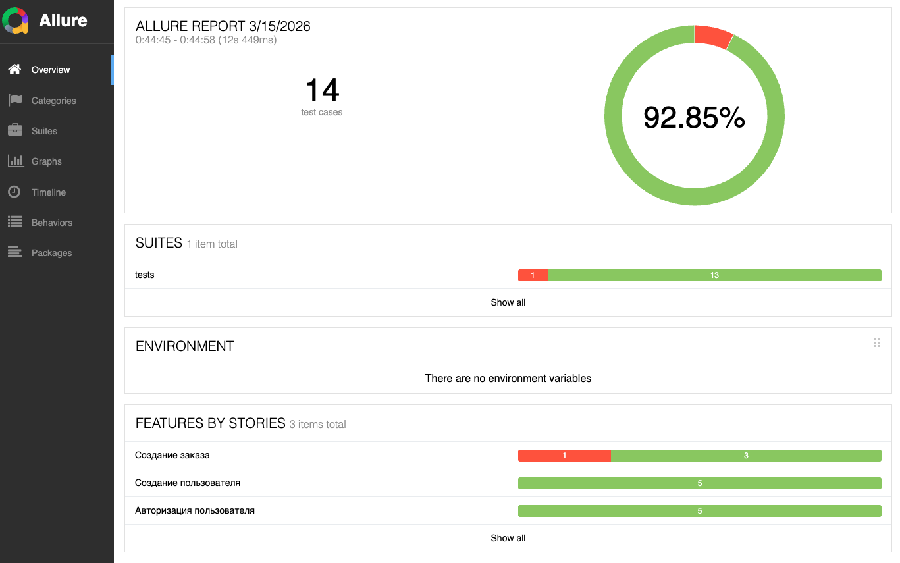
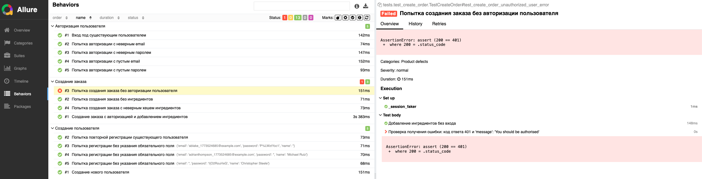
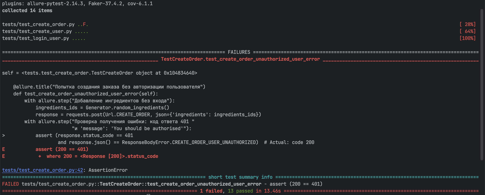

## Автоматизированное тестирование REST API сервиса оформления заказов

🇷🇺 | **RU**

Проект посвящён разработке автотестов для REST API сервиса, который обеспечивает регистрацию пользователей, авторизацию и оформление заказов.

Тестирование реализовано на Python с использованием фреймворка **pytest**, библиотеки **requests** для отправки HTTP-запросов и **Allure** для генерации отчётов о выполнении тестов.

### Покрытые сценарии

Реализованы API-тесты для следующих групп эндпоинтов:

#### Создание пользователя

- создание нового пользователя с уникальными данными;
- попытка регистрации уже существующего пользователя;
- попытка регистрации без обязательных полей.

#### Авторизация пользователя

- вход под существующим пользователем;
- попытка входа с неверным email;
- попытка входа с неверным паролем;
- попытка входа с пустыми данными.

#### Создание заказа

- создание заказа с авторизацией пользователя;
- создание заказа без авторизации;
- создание заказа с ингредиентами;
- попытка создания заказа без ингредиентов;
- создание заказа с некорректным хешем ингредиентов.

### Использованные техники

- API-тестирование
- параметризация тестов (`pytest.mark.parametrize`)
- генерация тестовых данных
- использование фикстур pytest
- использование Allure для тестовой отчётности
- негативные и позитивные сценарии

### Структура проекта

- tests/ – тесты для API-эндпоинтов
- helpers/ – вспомогательные модули 
- endpoints.py – описание URL-эндпоинтов
- generator.py – генератор тестовых данных
- conftest.py – фикстуры
- data.py – тестовые данные и ожидаемые ответы API

### Запуск автотестов

#### Установка зависимостей:

```
pip install -r requirements.txt
```

#### Запуск тестов и генерация отчета:

```
pytest --alluredir=./allure-results
```

#### Просмотр отчета:

```
allure serve ./allure-results
```

После выполнения команды автоматически откроется HTML-отчёт с результатами тестирования.

Общий обзор отчёта с количеством успешных и неуспешных тестов:



Отчет для упавшего теста с информацией о проверке и причине ошибки:



---

### Найденные дефекты

В ходе тестирования был обнаружен дефект в работе эндпоинта создания заказа.



#### ID: BUG-API-001
#### Создание заказа POST /api/orders: Статус 200 и создание заказа без авторизации пользователя

**Описание**

Сервис позволяет оформить заказ без авторизации пользователя.

**Серьёзность**

Высокая

**Шаги воспроизведения**

1. Отправить POST-запрос на `/api/orders`.
2. Передать список ингредиентов.
3. Не передавать токен авторизации.

**Ожидаемый результат**

```
Status code: 401
message: "You should be authorised"
Заказ не создан.
```

**Фактический результат**
```
Status code: 200
success: true
Система создаёт заказ без авторизации пользователя.
```

[--> Наверх](#автоматизированное-тестирование-rest-api-сервиса-оформления-заказов)

---

## Automated Testing of Order Processing REST API

🇬🇧 | **EN**

This project demonstrates automated testing of a REST API responsible for user registration, authentication, and order creation.

Tests are implemented using **Python**, **pytest**, and the **requests** library.  
Test execution results are visualized using **Allure reports**.

### Implemented Test Scenarios

API tests were implemented for the following endpoint groups.

#### User Registration

- create a new user with unique data
- attempt to register an already existing user
- attempt to register without required fields

#### User Authentication

- login with a valid user
- login with incorrect email
- login with incorrect password
- login with empty credentials

#### Order Creation

- create an order with user authorization
- create an order without authorization
- create an order with ingredients
- attempt to create an order without ingredients
- create an order with an invalid ingredient hash


### Testing Techniques Used

- API testing
- pytest parameterization
- test data generation
- pytest fixtures
- Allure reporting
- positive and negative test scenarios


### Project Structure

- tests/ – API test cases
- helpers/ – helper modules
- endpoints.py – API endpoint definitions
- generator.py – dynamic test data generation
- conftest.py – pytest fixtures
- data.py – test data and expected responses

### Running Tests

#### Install dependencies:

```
pip install -r requirements.txt
```

#### Run tests an dgenerate Allure report:

```
pytest --alluredir=./allure-results
```

#### Check report:

```
allure serve ./allure-results
```

The command opens an HTML report containing test results.

Overview of the report with the summary of passed and failed tests:


Failed test report with information about the test case:


---

### Detected Defect


#### ID: BUG-API-001
#### Order Creation POST /api/orders: Status 200 and order creation without authorization

**Description**

The system allows creating an order without user authorization.

**Severity**

High

**Steps to reproduce**

1. Send a POST request to `/api/orders`.
2. Pass a list of ingredients.
3. Do not provide an authorization token.

**Expected result**

```
Status code: 401
message: "You should be authorised"

The order doesn't create.
```

**Actual Result**

```
Status code: 401
message: "You should be authorised"

The system successfully creates an order without authorization.
```

[--> Up](#automated-testing-of-order-processing-rest-api)