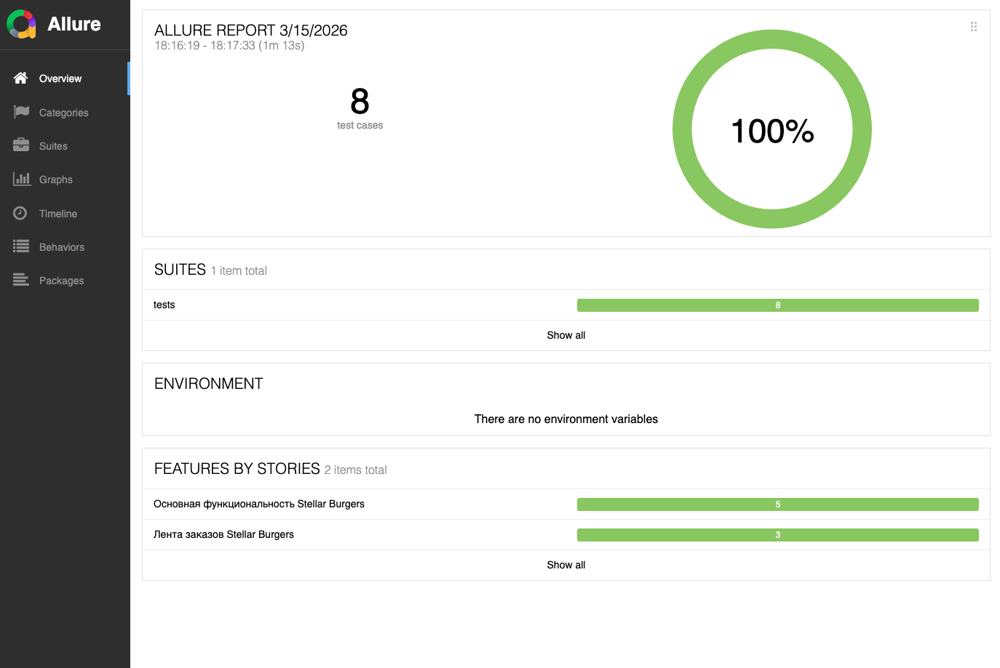
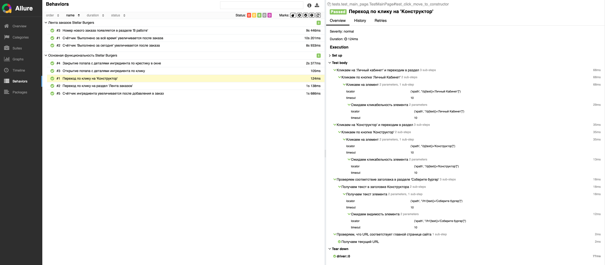

## Автоматизированное UI-тестирование веб-приложения конструктора бургеров

🇷🇺 | **RU**

Проект демонстрирует автоматизацию тестирования пользовательского интерфейса веб-приложения с использованием **Selenium WebDriver**, **pytest** и **Allure Report**.

Тесты реализованы с применением паттерна **Page Object Model (POM)**, что позволяет разделить логику взаимодействия со страницами и тестовые сценарии, повысить читаемость тестов и упростить поддержку тестового набора.

### Проверяемая функциональность

#### Основная функциональность приложения

Проверяются пользовательские сценарии работы с интерфейсом:

- переход в раздел **«Конструктор»**;
- переход в раздел **«Лента заказов»**;
- открытие и закрытие всплывающего окна с деталями ингредиента;
- увеличение счётчика ингредиента после его добавления в заказ.

#### Раздел «Лента заказов»

Проверяются ключевые элементы интерфейса:

- увеличение счётчика **«Выполнено за всё время»** после оформления заказа;
- увеличение счётчика **«Выполнено за сегодня»**;
- отображение номера нового заказа в разделе **«В работе»**.

### Кроссбраузерное тестирвоание

Тесты выполняются в двух браузерах:

- Google Chrome
- Mozilla Firefox

Выбор браузера осуществляется через параметр запуска pytest.

### Структура проекта

- `tests/` – директория с тестами
  - `test_main_page.py` – тесты для проверки основной функциональности
  - `test_order_feed_page.py` –  тесты для проверки раздела "Лента заказов"
  - `conftest.py` – pytest-фикстуры и конфигурация браузеров
  
- `pages/` – директория с POM
  - `base_page.py` – базовые методы взаимодействия со страницами
  - `main_page.py` – методы для главной страницы приложения
  - `order_page.py` –  методы, используемые в тестах для страницы заказа
  - `login_page.py` – методы страницы авторизации

- `helpers/` - директория c утилитами для тестов
  - `data.py` – тестовые данные
  - `curl.py` – URL тестируемых страниц

- `locators/` – директория с локаторами
  - `main_page_locators.py` – локаторы элементов главной страницы
  - `order_feed_page_locators.py` – локаторы для работы со страницей заказа
  - `login_page_locators.py` – локаторы страницы авторизации

### Запуск автотестов

#### Установка зависимостей

``` 
pip install -r requirements.txt
```

#### Запуск тестов в Google Chrome и генерация отчета

```
pytest --browser chrome --alluredir=./allure-results
```

#### Просмотр отчета

```
allure serve ./allure-results
```

### Отчет о тестировании

В проекте используется **Allure Report** для визуализации результатов тестирования.



Детализация одного из тестовых сценариев:



---

## Automated UI Testing of a Burger Builder Web Application

🇬🇧 | **EN**

This project demonstrates automated UI testing of a web application using **Selenium WebDriver**, **pytest**, and **Allure Report**.

Tests are implemented using the **Page Object Model (POM)** pattern, which separates page interaction logic from test scenarios, improving readability and maintainability of the test suite.

### Tested Functionality

#### Core Application Features

The following UI scenarios are tested:

- navigation to the **Constructor** section;
- navigation to the **Order Feed** section;
- opening an ingredient details modal;
- closing the modal window;
- increasing the ingredient counter after adding it to an order.

#### Order Feed Section

The following interface elements are verified:

- the **"Completed All Time"** counter increases after creating an order;
- the **"Completed Today"** counter increases;
- the newly created order number appears in the **"In Progress"** section.

### Cross-browser testing

Tests are executed in two browsers:

- Google Chrome
- Mozilla Firefox

The browser can be selected using pytest parameters.

### Project Structure

- `tests/` – directory with tests
  - `test_main_page.py` – tests for core functionality
  - `test_order_feed_page.py` – tests for the order feed page
  - `conftest.py` – pytest fixtures and browser configuration
  
- `pages/` – directory with POM
  - `base_page.py` – base page methods
  - `main_page.py` – methods for the main page
  - `order_page.py` –  methods for the order feed page
  - `login_page.py` – login page methods

- `helpers/` - directory with locators
  - `data.py` – test data
  - `curl.py` – application URLs

- `locators/` – директория с локаторами
  - `main_page_locators.py` – locators for main page elements
  - `order_feed_page_locators.py` – locators for order feed page
  - `login_page_locators.py` – locators for login page

### Running Tests

#### Install dependencies

``` 
pip install -r requirements.txt
```

#### Running tests in Google Chrome and report generating

```
pytest --browser chrome --alluredir=./allure-results
```

#### Open report

```
allure serve ./allure-results
```

### Test Reports

The project uses **Allure Report** for visualizing test results.


Detailing one of the test scenarios:


