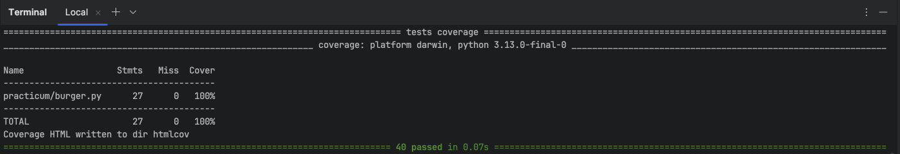
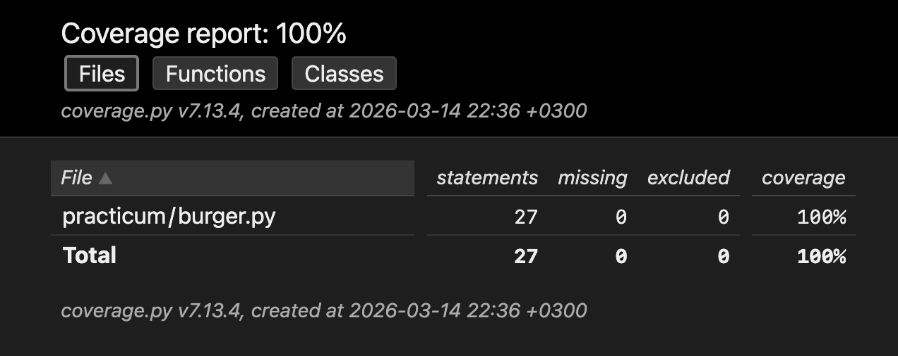

## Автоматизированное тестирование: юнит-тесты

🇷🇺 | **RU**

Проект посвящён разработке unit-тестов для логики приложения, которое позволяет пользователю собирать и заказывать бургеры.

В рамках задания реализовано автоматизированное тестирование класса `Burger`, отвечающего за формирование состава бургера, управление ингредиентами и расчёт стоимости заказа.

### Цель тестирования

Проверка корректности логики формирования бургера:

- установка булочек;
- добавление ингредиентов;
- удаление ингредиентов;
- изменение порядка ингредиентов;
- корректный расчёт стоимости;
- корректное формирование чека заказа.

### Протестированные методы

| Метод | Проверка |
|-----|-----|
| `set_buns()` | корректная установка булочки |
| `add_ingredient()` | добавление ингредиента |
| `remove_ingredient()` | удаление ингредиента |
| `move_ingredient()` | изменение порядка ингредиентов |
| `get_price()` | корректный расчёт стоимости |
| `get_receipt()` | корректное формирование чека |

- Процент покрытия: 100%
- HTML-отчёт о покрытии формируется автоматически после отправки команды, обозначенной в пункте [Запуск автотестов и создание HTML-отчета о покрытии](#запуск-автотестов-и-создание-html-отчета-о-покрытии) (`htmlcov/index.html`).

### Использованные техники тестирования

- юнит-тестирование
- параметризация (`pytest.mark.parametrize`)
- фикстуры (`pytest fixtures`)
- мокирование (`unittest.mock`)

### Структура проекта

- practicum - код тестируемого приложения
- tests/ - автотесты
- data.py - тестовые данные
- conftest.py - фикстуры
- requirements.txt – список зависимостей

### Запуск автотестов

#### Установка зависимостей:

```
pip install -r requirements.txt
```

#### Запуск автотестов и создание HTML-отчета о покрытии:

- вывод процента покрытия в терминал
- формирование HTML-отчета, который можно посмотреть в папке **htmlcov/**:

```
pytest --cov=practicum.burger --cov-report=term --cov-report=html
```

### Результаты выполнения тестов

Вывод результатов тестирования и покрытие в терминале:



HTML-отчёт о покрытии, сформированный после выполнения тестов:



---

## Automated Testing: unit-tests

🇬🇧 | **EN**

This project focuses on implementing **unit tests** for the logic of the application, which allows users to build and order burgers.

The implemented tests verify the functionality of the `Burger` class responsible for managing burger composition, ingredients, and price calculation.

### Testing Objective

Verify the correctness of burger business logic:

- setting burger buns
- adding ingredients
- removing ingredients
- moving ingredients
- calculating total price
- generating order receipt

### Test Coverage

Unit tests were implemented for the **Burger** class.

The following methods are tested:

| Method | Validation |
|-----|-----|
| `set_buns()` | bun assignment |
| `add_ingredient()` | ingredient addition |
| `remove_ingredient()` | ingredient removal |
| `move_ingredient()` | ingredient order change |
| `get_price()` | correct price calculation |
| `get_receipt()` | correct receipt generation |

- Test coverage: **100%**
- The HTML coverage report is generated automatically after running the command described in the [Running Tests and Generating the HTML Coverage Report](#run-tests-and-generate-coverage-html-report) section (htmlcov/index.html).

### Testing Techniques Used

- unit testing
- pytest parameterization (`pytest.mark.parametrize`)
- pytest fixtures (`pytest fixtures`)
- mocking (`unittest.mock`)

### Project Structure

- practicum - application source code
- tests - automated tests
- data - test data
- conftest - pytest fixtures
- requirements.txt – list of dependencies

### Running Tests

#### Install dependencies

```
pip install -r requirements.txt
```

#### Run tests and generate coverage HTML-report:

```
pytest --cov=practicum.burger --cov-report=term --cov-report=html
```

### Tests Execution Results

Pytest test execution and coverage summary in terminal:


HTML coverage report generated by pytest-cov:

