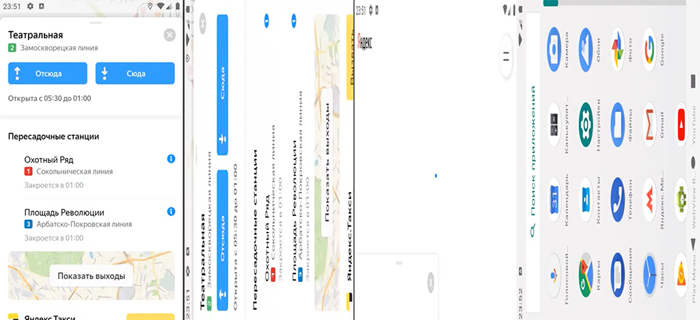

### BUG-001 – При изменении ориентации устройства с портретной на альбомную приложение завершает работу

🇷🇺 | **RU** 

**Предусловия:**
- В настройках устройства включен автоповорот.
- Ориентация устройства – портретная.
- Установлено и запущено приложение, ver. 3.6.

**Шаги воспроизведения:**
1. Построить маршрут между любыми двумя станциями.
2. Перевести устройство из портретной ориентации в альбомную.

**Ожидаемый результат:**  
Приложение продолжает работать. 
Ориентация измениласью
Сохранились масштаб карты и построенный маршрут.

**Фактический результат:**  
Приложение аварийно завершает работу.

**Серьёзность:** Блокирующий  
**Приоритет:** Высокий  
**Статус:** Открыт

**Окружение:**
- Платформа: Android  
- Версия ОС: Android 9.0 Pie
- Устройство: Honor 8 (эмулятор Android Studio)
- Версия приложения: 3.6

**Вложения:**  
- Скриншот:

    

- Логи:

    [BUG-001 Crash Logs](../logs/BUG-001-orientation_change_crash.txt)

---

### BUG-001 – Application crashes when switching device orientation from portrait to landscape

🇬🇧 | **EN** 

**Preconditions:**
- Auto-rotation is enabled in the device settings.
- The device orientation is portrait.
- The application is installed and launched, ver. 3.6.

**Steps to reproduce:**
1. Create a route between any two stations.
2. Rotate the device from portrait to landscape.

**Expected result:**  
The application continues running, the orientation has changed, and the map scale and route have been preserved.

**Actual result:**  
The application crashes.

**Severity:** Blocker
**Priority:** High
**Status:** Open

**Environment:**
- Platform: Android
- OS version: Android 9.0 Pie
- Device: Honor 8 (Android Studio emulator)
- App version: 3.6 

**Attachments:**  
- Screenshot:

    
    
- Logs:

    [BUG-001 Crash Logs](../logs/BUG-001-orientation_change_crash.txt)
