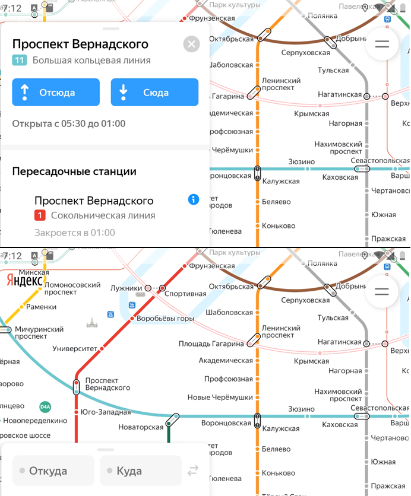

### BUG-002 – В карточке станции, открытой лонг-тапом, отсутствуют кнопки "Отсюда" и "Сюда"

🇷🇺 | **RU** 

**Предусловия:**
- Установлено и запущено приложение, ver. 3.6.

**Шаги воспроизведения:**
1. Лонг-тапом выбрать любую станцию на карте (например, «Павелецкая»).
2. Проверить отображение карточки станции.

**Ожидаемый результат:**  
В левой части экрана отображается свёрнутая карточка станции с кнопками «Отсюда» и «Сюда».

**Фактический результат:**  
На карточке станции кнопки «Отсюда» и «Сюда» отсутствуют.

**Серьёзность:** Стандартный  
**Приоритет:** Средний  
**Статус:** Открыт

**Окружение:**
- Платформа: Android  
- Версия ОС: Android 9.0 Pie
- Устройство: Honor 8 (эмулятор Android Studio)
- Версия приложения: 3.6

**Вложения:** 
- Скриншот:

    

---

### BUG-002 – “From here” and “To here” buttons are missing in the station card opened by long tap

🇬🇧 | **EN** 

**Preconditions:**
- The application is installed and launched, ver. 3.6.

**Steps to reproduce:**
1. Perform a long tap on any station on the map (for example, “Paveletskaya”).
2. Check the station card display.

**Expected result:**  
A collapsed station card with “From here” and “To here” buttons is displayed on the left side of the screen.

**Actual result:**  
The “From here” and “To here” buttons are missing from the station card.

**Severity:** Major
**Priority:** Medium
**Status:** Open

**Environment:**
- Platform: Android
- OS version: Android 9.0 Pie
- Device: Honor 8 (Android Studio emulator)
- App version: 3.6 

**Attachments:**  
- Screenshot:

    