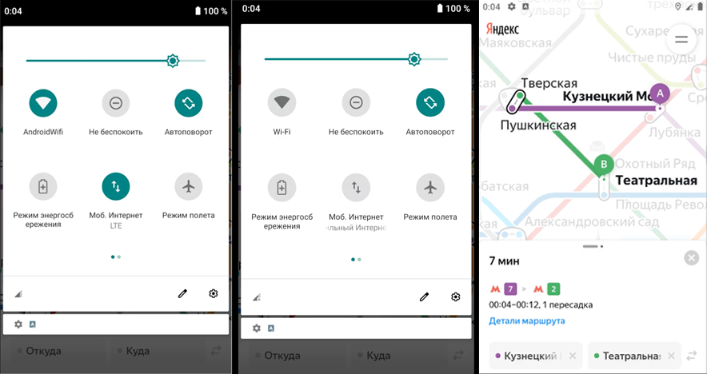

### BUG-003 – При отсутствии интернет-соединения не появляется уведомление об ошибке

🇷🇺 | **RU** 

**Предусловия:**
- Установлено и запущено приложение, ver. 3.6.

**Шаги воспроизведения:**
1. Отключить интернет-соединение в настройках устройства / эмулятора.
2. Проверить приложение на отображение сообщений об ошибке.

**Ожидаемый результат:**  
На экране отображается уведомление об ошибке.

**Фактический результат:**  
Уведомление об ошибке не появляется.

**Серьёзность:** Стандартный  
**Приоритет:** Средний  
**Статус:** Открыт

**Окружение:**
- Платформа: Android  
- Версия ОС: Android 9.0 Pie
- Устройство: Honor 8 (эмулятор Android Studio)
- Версия приложения: 3.6

**Вложения:**  
- Скриншот:

    

---

### BUG-003 – No error notification is displayed when there is no internet connection

🇬🇧 | **EN** 

**Preconditions:**
- The application is installed and launched, ver. 3.6.

**Steps to reproduce:**
1. Disable the internet connection on the device / emulator.
2. Check the application for error notifications.

**Expected result:**  
An error notification is displayed on the screen.

**Actual result:**  
The error notification is not displayed.

**Severity:** Major
**Priority:** Medium
**Status:** Open

**Environment:**
- Platform: Android
- OS version: Android 9.0 Pie
- Device: Honor 8 (Android Studio emulator)
- App version: 3.6 

**Attachments:**  
- Screenshot:

    