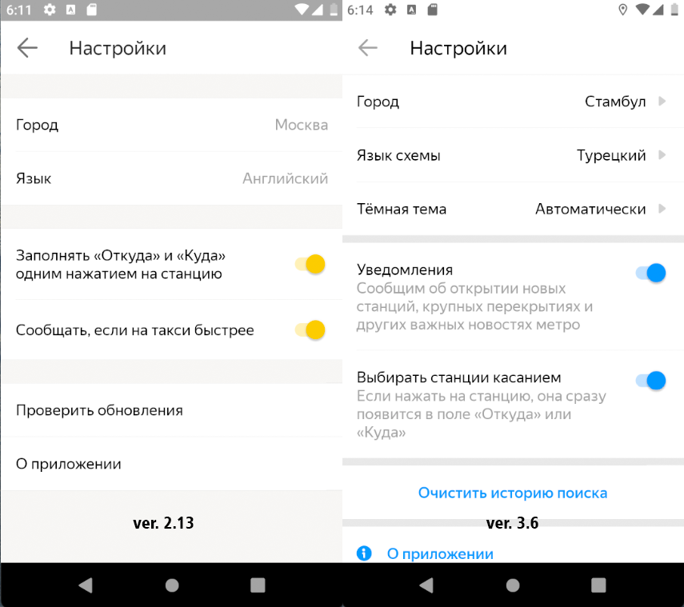

### BUG-004 – После обновления приложение не сохраняет настройки языка

🇷🇺 | **RU** 

**Предусловия:**
- Установлено и запущено приложение, ver. 2.13.

**Шаги воспроизведения:**
1. В настройках приложения изменить язык на английский
2. Обновить приложение до версии ver. 3.6
3. Запустить приложение.

**Ожидаемый результат:**  
Все элементы приложения отображаются на английском языке.  
В настройках приложения выбран английский язык.

**Фактический результат:**  
В приложении по умолчанию выбран русский язык.

**Серьёзность:** Стандартный  
**Приоритет:** Средний  
**Статус:** Открыт

**Окружение:**
- Платформа: Android  
- Версия ОС: Android 9.0 Pie
- Устройство: Honor 8 (эмулятор Android Studio)
- Версия приложения: 3.6

**Вложения:**  
- Скриншот:

    

---

### BUG-004 – Application does not save language settings after update

🇬🇧 | **EN** 

**Preconditions:**
- The application is installed and launched, ver. 2.13.

**Steps to reproduce:**
1. Change the application language to English in settings.
2. Update the application to version ver. 3.6.
3. Launch the application.

**Expected result:**  
All application elements are displayed in English.  
English is selected as the application language in settings.

**Actual result:**  
The application language is set to Russian by default.

**Severity:** Major
**Priority:** Medium
**Status:** Open

**Environment:**
- Platform: Android
- OS version: Android 9.0 Pie
- Device: Honor 8 (Android Studio emulator)
- App version: 3.6 

**Attachments:**  
- Screenshot:

    