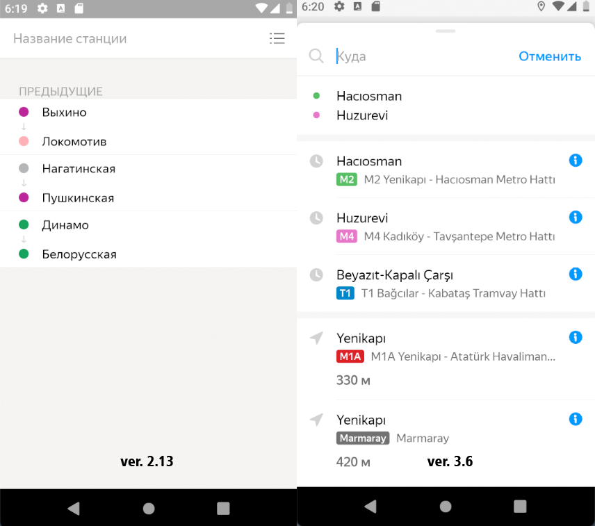

### BUG-005 – После обновления приложение не сохраняет историю маршрутов
🇷🇺 | **RU** 

**Предусловия:**
- Установлено и запущено приложение, ver. 2.13.

**Шаги воспроизведения:**
1. Построить любой маршрут (например, «Динамо – Аэропорт»).
2. Обновить приложение до версии ver. 3.6.
3. Запустить приложение.
4. В настройках приложения выбрать схему метро для Москвы.
5. Нажать на поле «Откуда» или «Куда».

**Ожидаемый результат:**  
В истории маршрутов отображаются маршруты, построенные в предыдущей версии приложения (например, «Динамо – Аэропорт»).

**Фактический результат:**  
В истории отображаются маршруты, не соответствующие тем, что были построены  
в предыдущей версии приложения.

**Серьёзность:** Стандартный  
**Приоритет:** Средний  
**Статус:** Открыт

**Окружение:**
- Платформа: Android  
- Версия ОС: Android 9.0 Pie
- Устройство: Honor 8 (эмулятор Android Studio)
- Версия приложения: 3.6

**Вложения:**  
- Скриншот:

    

---

### BUG-005 – Application does not save route history after update

🇬🇧 | **EN** 

**Preconditions:**
- The application is installed and launched, ver. 2.13.

**Steps to reproduce:**
1. Build any route (for example, “Dynamo – Aeroport”).
2. Update the application to version ver. 3.6.
3. Launch the application.
4. Select the Moscow metro scheme in application settings.
5. Tap the “From” or “To” field.

**Expected result:**  
Routes built in the previous application version  
(for example, “Dynamo – Aeroport”) are displayed in the route history.

**Actual result:**  
The route history displays routes that do not match those built  
in the previous application version.

**Severity:** Major
**Priority:** Medium
**Status:** Open

**Environment:**
- Platform: Android
- OS version: Android 9.0 Pie
- Device: Honor 8 (Android Studio emulator)
- App version: 3.6 

**Attachments:**  
- Screenshot:

    