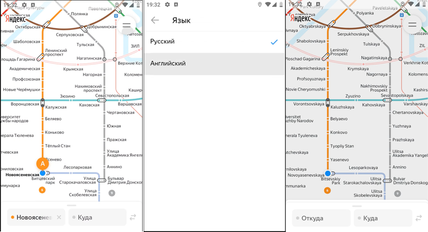

### BUG-006 – При выборе английского языка в настройках язык приложения не меняется на английский
🇷🇺 | **RU** 

**Предусловия:**
- Установлено и запущено приложение, ver. 3.6.

**Шаги воспроизведения:**
1. Открыть настройки приложения.
2. Изменить язык приложения на английский.

**Ожидаемый результат:**  
Все элементы интерфейса приложения отображаются на английском языке.

**Фактический результат:**  
На английский язык переключаются только названия станций и линий метро.  
Текст кнопок навигации, элементов дополнительной функциональности, настроек и информационный текст остаются на русском языке.

**Серьёзность:** Критический  
**Приоритет:** Высокий  
**Статус:** Открыт

**Окружение:**
- Платформа: Android  
- Версия ОС: Android 9.0 Pie
- Устройство: Honor 8 (эмулятор Android Studio)
- Версия приложения: 3.6

**Вложения:**  
- Скриншот:

    

---

### BUG-006 – Application language does not switch to English when English is selected
🇬🇧 | **EN** 

**Preconditions:**
- The application is installed and launched, ver. 3.6.

**Steps to reproduce:**
1. Open application settings.
2. Change the application language to English.

**Expected result:**  
All application interface elements are displayed in English.

**Actual result:**  
Only station names and metro line names are switched to English.  
Text on navigation buttons, additional functionality buttons, settings, and informational text remains in Russian.

**Severity:** Critical
**Priority:** High
**Status:** Open

**Environment:**
- Platform: Android
- OS version: Android 9.0 Pie
- Device: Honor 8 (Android Studio emulator)
- App version: 3.6 

**Attachments:**  
- Screenshot:

    