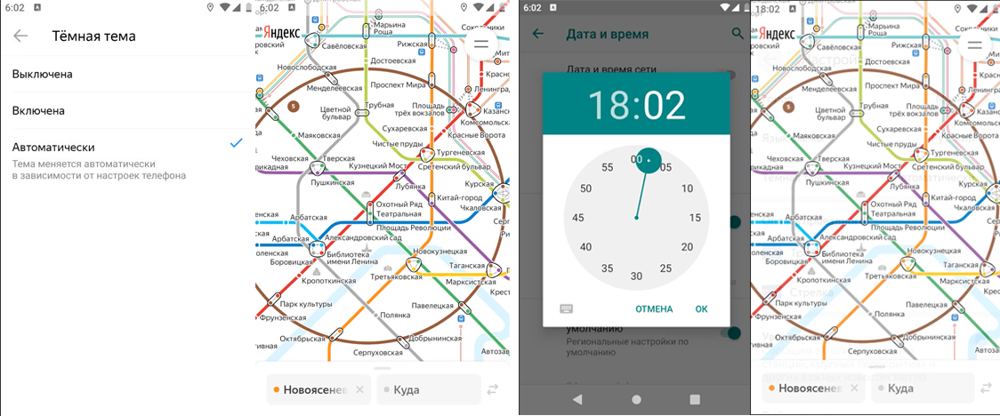

### BUG-007 – При выборе режима смены темы "Автоматический" тема приложения не меняется автоматически на темную в 18:00 по Мск
🇷🇺 | **RU** 

**Предусловия:**
- Установлено и запущено приложение, ver. 3.6.
- В настройках приложения выбран режим темы «Автоматический».

**Шаги воспроизведения:**
1. Зафиксировать текущий цвет темы – светлый.
2. Изменить системное время устройства, установить 18:00.
3. Проверить цвет темы.

**Ожидаемый результат:**  
Тема приложения автоматически изменяется на тёмную.

**Фактический результат:**  
Отображается светлая тема приложения.

**Серьёзность:** Критический  
**Приоритет:** Высокий  
**Статус:** Открыт

**Окружение:**
- Платформа: Android  
- Версия ОС: Android 9.0 Pie
- Устройство: Honor 8 (эмулятор Android Studio)
- Версия приложения: 3.6

**Вложения:**  
- Скриншот:

    

---

### BUG-007 – Application theme does not switch to dark automatically at 18:00 MSK
🇬🇧 | **EN** 

**Preconditions:**
- The application is installed and launched, ver. 3.6.

**Steps to reproduce:**
1. Check the current theme color – light.
2. Change the device system time and set it to 18:00.
3. Check the theme color.

**Expected result:**  
The application theme automatically switches to dark mode.

**Actual result:**  
The light theme is displayed.

**Severity:** Critical
**Priority:** High
**Status:** Open

**Environment:**
- Platform: Android
- OS version: Android 9.0 Pie
- Device: Honor 8 (Android Studio emulator)
- App version: 3.6 

**Attachments:**  
- Screenshot:

    