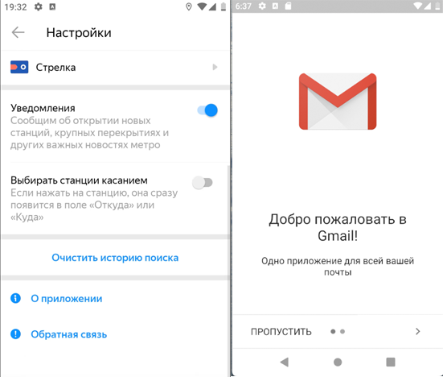

### BUG-007 – При нажатии на кнопку "Обратная связь" с помощью Webview открывается приложение почтового сервиса
🇷🇺 | **RU** 

**Предусловия:**
- Установлено и запущено приложение, ver. 3.6.

**Шаги воспроизведения:**
1. Открыть настройки приложения.
2. Нажать на кнопку «Обратная связь».

**Ожидаемый результат:**  
На экране отображается окно службы поддержки, открытое в режиме WebView.

**Фактический результат:**  
Открывается приложение почтового сервиса (Gmail).

**Серьёзность:** Критический  
**Приоритет:** Высокий  
**Статус:** Открыт

**Окружение:**
- Платформа: Android  
- Версия ОС: Android 9.0 Pie
- Устройство: Honor 8 (эмулятор Android Studio)
- Версия приложения: 3.6

**Вложения:**  
- Скриншот:

    

---

### BUG-008 – Email application opens instead of feedback screen in WebView
🇬🇧 | **EN** 

**Preconditions:**
- The application is installed and launched, ver. 3.6.

**Steps to reproduce:**
1. Open application settings.
2. Tap the “Feedback” button.

**Expected result:**  
The support screen is opened inside the application using WebView..

**Actual result:**  
The email application (Gmail) is opened.

**Severity:** Critical
**Priority:** High
**Status:** Open

**Environment:**
- Platform: Android
- OS version: Android 9.0 Pie
- Device: Honor 8 (Android Studio emulator)
- App version: 3.6 

**Attachments:**  
- Screenshot:

    