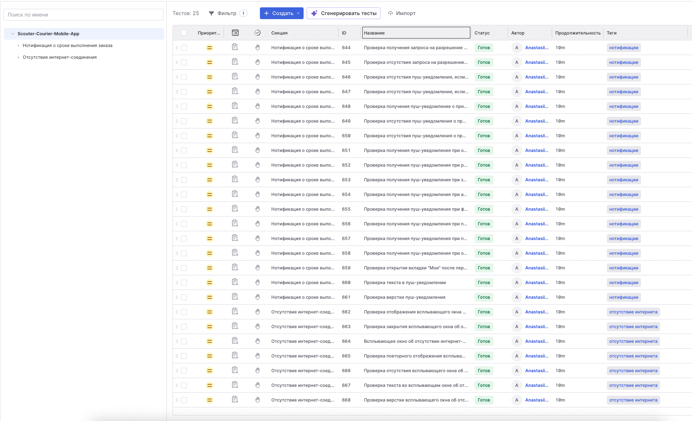
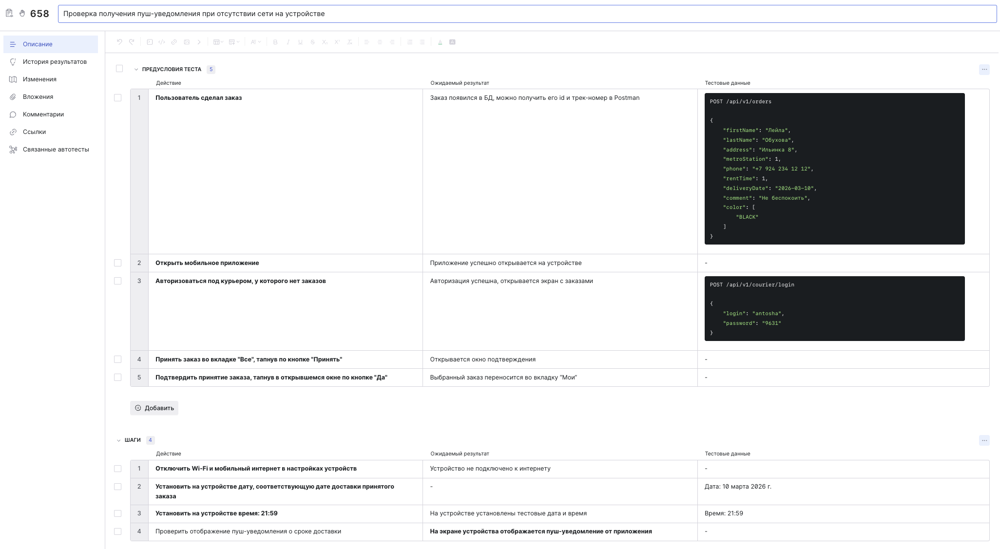
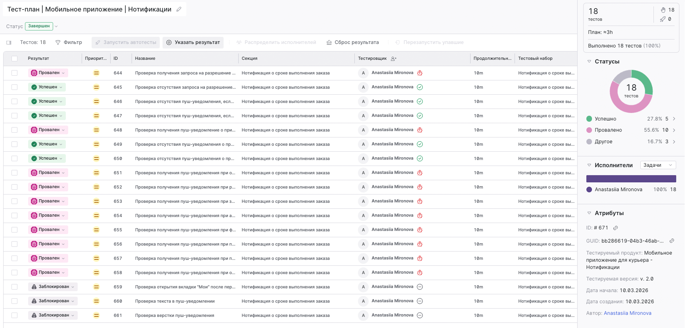
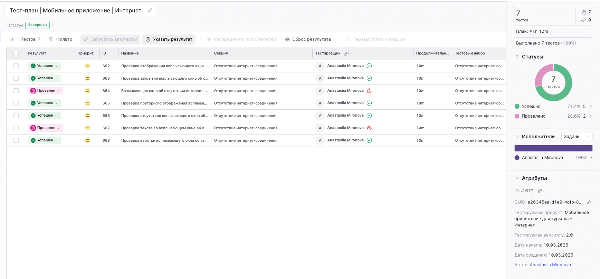
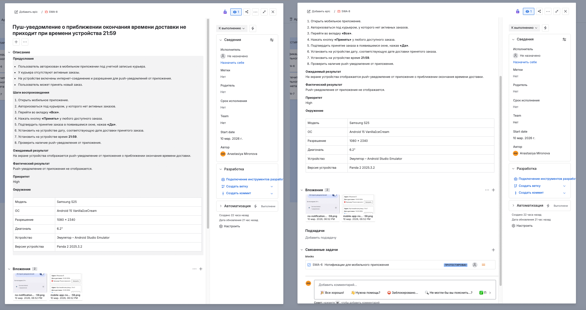
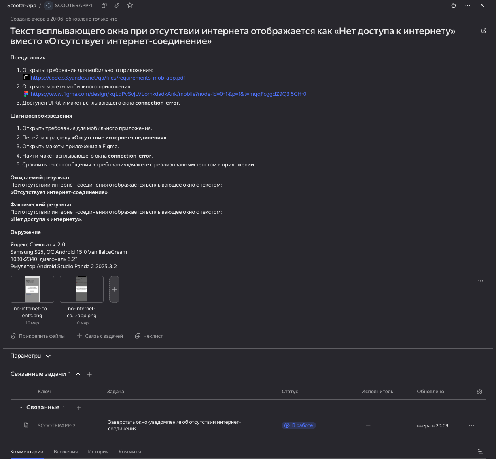

## Тестирование мобильного приложения для курьера сервиса аренды самокатов

### Оглавление

- [Описание проекта](#описание-проекта)
- [Связь с проектами в репозитории](#связь-с-проектами-в-репозитории)
- [Тестовое окружение](#тестовое-окружение)
- [Тест-кейсы](#тест-кейсы)
- [Создание тест-планов и прогон тестов](#создание-тест-планов-и-прогон-тестов)
- [Баг-репорты](#баг-репорты)
- [Итоги тестирования](#итоги-тестирования)

### Описание проекта

Проект посвящён ручному тестированию мобильного приложения, предназначенному для курьера, доставляющего пользователю арендованный самокат. Основными требованиями для проведения тестирования являлись:

1. Проверка корректности нотификаций.
2. Проверка работы приложения при отсутствии интернет-соединения.
3. Составление и выполнение тест-кейсов для проверки функциональности приложения.

[--> К оглавлению](#оглавление)

### Связь с проектами в репозитории

Тестируемое веб-приложение является частью общей системы аренды самокатов, включающей несколько компонентов:

| Компонент                    | Назначение                                       | Ссылка                                                                                 |
| ---------------------------- | ------------------------------------------------ | -------------------------------------------------------------------------------------- |
| Веб-приложение               | Оформление заказа пользователем                  | [Перейти](https://github.com/mrnvnst/GitHub-QA-portfolio/tree/main/Manual-Testing/Web-App/Scouter-Rental-Web-App)                                                                           |
| Мобильное приложение курьера | Работа курьера с заказами                        | Вы находитесь здесь                  |

[--> К оглавлению](#оглавление)

### Тестовое окружение

Тестирование выполнялось в следующем окружении:

#### Устройство

| Параметр | Значение |
|---|---|
| Модель | Samsung S25   |
| ОС | Android 15 VanillaIceCream   |
| Разрешение | 1080 × 2340 |
| Диагональ | 6.2" |

#### Программная среда

| Параметр | Значение |
|---|---|
| Эмулятор | Android Studio Emulator |
| Версия Android Studio | Panda 2 2025.3.2 |

#### Инструменты тестирования

| Инструмент | Назначение |
|---|---|
| TestIT | управление тест-кейсами |
| Jira / Яндекс Трекер | баг-трекинг |
| Google Sheets | подготовка баг-репортов |

[--> К оглавлению](#оглавление)

### Тест-кейсы 

Для проверки функциональности нотификаций и работы приложения при отсутствии интернет-соединения и после его восстановления было разработано **25 тест-кейсов**.

Тест-кейсы были оформлены в TestIT.



Пример тест-кейса, проверяющего получение курьером push-уведомлений при отсутствии активного интернет-соединения:



[--> К оглавлению](#оглавление)

### Создание тест-планов и прогон тестов

Для каждой проверяемой функциональности были созданы отдельные **тест-планы**, после чего выполнен прогон тестов.

#### Проверка нотификаций



#### Проверка работы приложения без интернет-соединения



Результаты выполнения тестов фиксировались в системе TestIT.

[--> К оглавлению](#оглавление)

### Баг-репорты

В ходе тестирования было выявлено **15 дефектов**, которые были оформлены в виде баг-репортов.

| Функциональность     | Всего тестов | Passed | Failed | Blocked |
| -------------------- | ------------ | ------ | ------ | ------- |
| Нотификации          | 18           | 5      | 10     | 3       |
| Работа без интернета | 7            | 5      | 2      | 0       |
| **Итого**            | **25**       | **10** | **12** | **3**   |


```Pass Rate – 40%```

#### Ошибки при отсутствии интернет-соединения (2)

Обнаружены дефекты:

- **Minor** — ошибка верстки всплывающего окна, уведомляющего об отсутствии интернет-соединения.
- **Major** — всплывающее окно возможно закрыть тапом за его пределами, что противоречит требованиям приложения.

#### Ошибки в работе нотификаций (13)

Проверка функциональности push-уведомлений выявила значительные проблемы.

Из полного набора тестов, проверяющих работу уведомлений, успешно прошли **только 5 проверок**.

Основные выявленные проблемы:

- приложение **не запрашивает разрешение на отправку уведомлений при первом запуске**: запрос появляется только при подборе заказа курьером;
- после предоставления разрешения **уведомления не приходят** по запланированному сценарию (уведомление курьера о скором истечении заказа);
- пуш о заказе появляется только один раз – в момент нажатия курьером кнопки **«Принять»**;
- часть тестов была помечена как **Blocked**, так как дальнейшая проверка функциональности невозможна из-за отсутствия уведомлений.

Первоначально баг-репорты были оформлены в **Google Sheets**, после чего перенесены в **Jira**.

Пример одного из баг-репортов в Jira:



Во время ведения проекта была протестирована функциональность **Яндекс Трекера**, который также предоставляет возможность оформления баг-репортов. Далее пример представления баг-репорта в Трекере:



[--> К оглавлению](#оглавление)

### Итоги тестирования

В ходе тестирования мобильного приложения для курьера были выявлены дефекты, затрагивающие ключевые функции приложения.

Основные проблемы связаны с:

- некорректной работой системы push-уведомлений;
- невозможностью полноценной проверки части функциональности из-за отсутствия уведомлений;
- отдельными некритическими UI-ошибками в интерфейсе приложения.

Функциональность работы приложения при отсутствии интернет-соединения в целом работает, однако обнаружены отдельные дефекты интерфейса и поведения всплывающих окон.

С учётом выявленных проблем можно сделать вывод, что **функциональность уведомлений требует доработки**, поскольку она влияет на основной рабочий процесс курьера.

Результаты тестирования и оформленные баг-репорты могут быть использованы командой разработки для исправления дефектов и повышения стабильности работы приложения.

[--> К оглавлению](#оглавление)