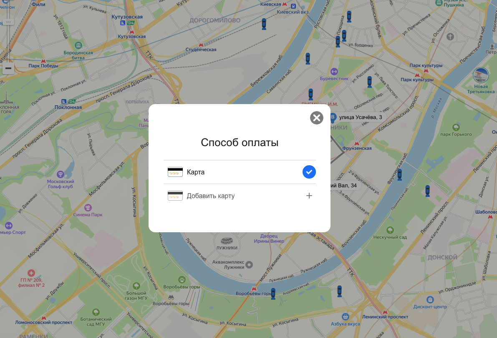

### BR-002 – В окне «Способ оплаты» не отображаются последние 4 цифры добавленной карты

🇷🇺 | **RU** 

**Предусловия:**
- Перейти на тестовый стенд.
- Ввести в поле «Откуда»: «Хамовнический вал, 18».
- Ввести в поле «Куда»: «Усачева, 34».
- Выбрать режим «Свой».
- Выбрать вид транспорта «Каршеринг».
- Нажать на кнопку «Забронировать».
- В селекторе выбора тарифа выбрать тариф «Походный».

**Шаги воспроизведения:**
1. Нажать на поле «Способ оплаты».
2. Нажать на кнопку «Добавить карту».
3. В форме добавления карты ввести данные:

    - Номер карты: 463801983657
    - Код: 76

4. Нажать на кнопку «Привязать».
5. Нажать на кнопку закрытия (крестик) в окне «Способ оплаты».
6. Проверить отображение данных карты в окне «Способ оплаты».

**Ожидаемый результат:**  
В окне «Способ оплаты» отображаются последние 4 цифры добавленной карты в формате:
«Карта 3657».

**Фактический результат:**  
Последние 4 цифры добавленной карты в окне «Способ оплаты» не отображаются.

**Серьёзность:** Критический  
**Приоритет:** Высокий  
**Статус:** Открыт

**Окружение:**
- Операционная система: macOS Sonoma 15.2 (24C101)
- Браузер: Firefox 134.0
- Разрешение экрана: 1920×1080

**Вложения:**  
- Скриншот:

    

---

### BR-002 – The last four digits of the added card are not displayed in the “Payment method” window

🇬🇧 | **EN** 

**Preconditions:**
- Open the test environment.
- Enter “Khamovnichesky Val, 18” into the “From” field.
- Enter “Usacheva, 34” into the “To” field.
- Select the “Custom” travel mode.
- Select “Car sharing” as the transportation method.
- Click the “Book” button.
- In the tariff selector, choose the “Hiking” tariff.

**Steps to reproduce:**
1. Click the “Payment method” field.
2. Click the “Add card” button.
3. In the add card form, enter:

    - Card number: 463801983657
    - Code: 76

4. Click the “Link” button.
5. Click the close (×) icon in the “Payment method” window.
6. Check the card information displayed in the “Payment method” window.

**Expected result:**  
The last four digits of the added card are displayed in the “Payment method” window in the format:
“Card 3657”.

**Actual result:**  
The last four digits of the added card are displayed in the “Payment method” window in the format:
“Card 3657”.

**Severity:** Critical

**Priority:** High

**Status:** Open

**Environment:**
- Operating System: macOS Sonoma 15.2 (24C101)
- Browser: Firefox 134.0
- Screen resolution: 1920×1080

**Attachments:**  
- Screenshot:

    
    
