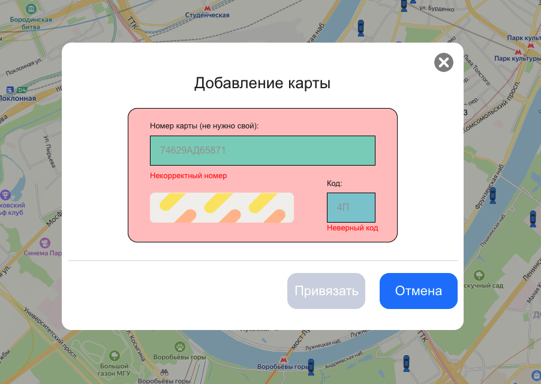

### BR-004 – Система позволяет вводить невалидные символы в поле «Код карты»

🇷🇺 | **RU** 

**Предусловия:**
- Перейти на тестовый стенд.
- Ввести в поле «Откуда»: «Хамовнический вал, 18».
- Ввести в поле «Куда»: «Усачева, 34».
- Выбрать режим «Свой».
- Выбрать вид транспорта «Каршеринг».
- Нажать на кнопку «Забронировать».
- В селекторе выбора тарифа выбрать тариф «Походный».

**Шаги воспроизведения:**
1. Нажать на поле «Способ оплаты».
2. В форме добавления карты ввести в поле «Код» значение:
3Д

**Ожидаемый результат:**  
Система не принимает невалидные символы и автоматически сбрасывает ввод в поле «Код».

**Фактический результат:**  
Введённые невалидные символы остаются в поле «Код».

**Серьёзность:** Критический  
**Приоритет:** Высокий  
**Статус:** Открыт

**Окружение:**
- Операционная система: macOS Sonoma 15.2 (24C101)
- Браузер: Firefox 134.0
- Разрешение экрана: 1920×1080

**Вложения:**  
- Скриншот:

    

---

### BR-004 – The system allows entering invalid characters into the “Card code” field

🇬🇧 | **EN** 

**Preconditions:**
- Open the test environment.
- Enter “Khamovnichesky Val, 18” into the “From” field.
- Enter “Usacheva, 34” into the “To” field.
- Select the “Custom” travel mode.
- Select “Car sharing” as the transportation method.
- Click the “Book” button.
- In the tariff selector, choose the “Hiking” tariff.

**Steps to reproduce:**
1. Click the “Payment method” field.
2. In the add card form, enter the following value into the “Card number” field:
746296АД5837

**Expected result:**  
The system does not accept invalid characters and clears the input in the “Card number” field.

**Actual result:**  
The entered invalid characters remain in the “Card number” field.

**Severity:** Critical

**Priority:** High

**Status:** Open

**Environment:**
- Operating System: macOS Sonoma 15.2 (24C101)
- Browser: Firefox 134.0
- Screen resolution: 1920×1080

**Attachments:**  
- Screenshot:

    
    