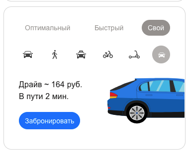

### BR-005 – Текст надписи в описании каршеринга не соответствует макету

🇷🇺 | **RU** 

**Предусловия:**
- Перейти на тестовый стенд.
- Ввести в поле «Откуда»: «Хамовнический вал, 18».
- Ввести в поле «Куда»: «Усачева, 34».

**Шаги воспроизведения:**
1. Выбрать режим «Свой».
2. Нажать на кнопку «Каршеринг» в выборе вида транспорта.

**Ожидаемый результат:**  
В информационной панели отображается надпись:
«Каршеринг ~ n. руб.»

**Фактический результат:**  
В информационной панели отображается надпись:
«Драйв ~ n. руб.»

**Серьёзность:** Низкий 

**Приоритет:** Стандартынй 

**Статус:** Открыт 

**Окружение:**
- Операционная система: macOS Sonoma 15.2 (24C101)
- Браузер: Firefox 134.0
- Разрешение экрана: 1920×1080

**Вложения:**  
- Скриншот:

    

---

### BR-005 – The car sharing description text does not match the design mockup

🇬🇧 | **EN** 

**Preconditions:**
- Open the test environment.
- Enter “Khamovnichesky Val, 18” into the “From” field.
- Enter “Usacheva, 34” into the “To” field.

**Steps to reproduce:**
1. Select the “Custom” travel mode.
2. Click the “Car sharing” transportation option.

**Expected result:**  
The information panel displays the text:
“Car sharing ~ n RUB”.

**Actual result:**  
The information panel displays the text:
“Drive ~ n RUB”.

**Severity:** Minor

**Priority:** Medium

**Status:** Open

**Environment:**
- Operating System: macOS Sonoma 15.2 (24C101)
- Browser: Firefox 134.0
- Screen resolution: 1920×1080

**Attachments:**  
- Screenshot:

    
    