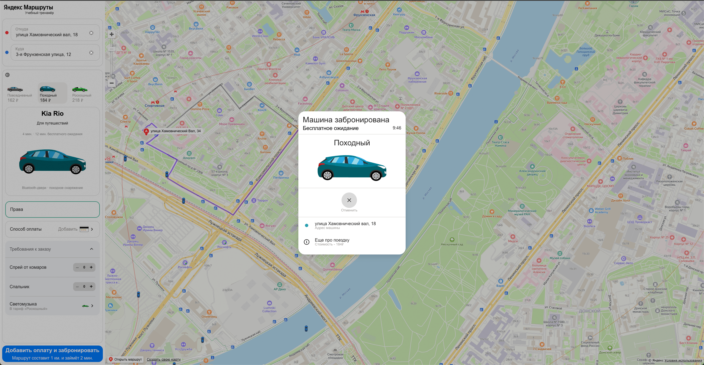

### BR-006 – Нажатие на кнопку «Отменить» в окне «Машина забронирована» не открывает окно подтверждения отмены поездки

🇷🇺 | **RU** 

**Предусловия:**
- Перейти на тестовый стенд.
- Ввести в поле «Откуда»: «Хамовнический вал, 18».
- Ввести в поле «Куда»: «Усачева, 34».
- Выбрать режим «Свой».
- Выбрать вид транспорта «Каршеринг».
- Нажать на кнопку «Забронировать».
- В селекторе выбора тарифа выбрать тариф «Походный».

**Шаги воспроизведения:**
1. Нажать на поле «Добавить права».
2. В форме добавления прав ввести данные:

- Имя: Евгений
- Фамилия: Петров
- Дата рождения: 01.04.1976
- Номер: 0909123456

3. Нажать на кнопку «Добавить».
4. Нажать на поле «Способ оплаты».
5. В форме добавления карты ввести:

- Номер карты: 463801983657
- Код: 76

6. Нажать на кнопку «Привязать».
7. Нажать на кнопку закрытия (крестик) в окне «Способ оплаты».
8. Нажать на кнопку «Забронировать».
9. В окне «Машина забронирована» нажать на кнопку «Отменить».

**Ожидаемый результат:**  
Открывается окно с сообщением:
«Вы уверены, что хотите отменить поездку?»

**Фактический результат:**  
Окно подтверждения отмены поездки не открывается.
Продолжает отображаться окно «Машина забронирована».

**Серьёзность:** Блокирующий  
**Приоритет:** Высокий  
**Статус:** Открыт

**Окружение:**
- Операционная система: macOS Sonoma 15.2 (24C101)
- Браузер: Firefox 134.0
- Разрешение экрана: 1920×1080

**Вложения:**  
- Скриншот:

    

---

### BR-006 – Clicking the “Cancel” button in the “Car booked” window does not open the trip cancellation confirmation dialog

🇬🇧 | **EN** 

**Preconditions:**
- Open the test environment.
- Enter “Khamovnichesky Val, 18” into the “From” field.
- Enter “Usacheva, 34” into the “To” field.
- Select the “Custom” travel mode.
- Select “Car sharing” as the transportation method.
- Click the “Book” button.
- In the tariff selector, choose the “Hiking” tariff.

**Steps to reproduce:**
1. Click the “Add driver’s license” field.
2. In the add driver’s license form, enter:
    - First name: Evgeniy
    - Last name: Petrov
    - Date of birth: 01.04.1976
    - License number: 0909123456

3. Click the “Add” button.
4. Click the “Payment method” field.
5. In the add card form, enter:

- Card number: 463801983657
- Code: 76

6. Click the “Link” button.
7. Close the “Payment method” window.
8. Click the “Book” button.
9. In the “Car booked” window, click the “Cancel” button.

**Expected result:**  
A confirmation dialog with the message
“Are you sure you want to cancel the trip?” is displayed.

**Actual result:**  
The cancellation confirmation dialog is not displayed.
The “Car booked” window remains visible.

**Severity:** Critical

**Priority:** High

**Status:** Open

**Environment:**
- Operating System: macOS Sonoma 15.2 (24C101)
- Browser: Firefox 134.0
- Screen resolution: 1920×1080

**Attachments:**  
- Screenshot:

    
    