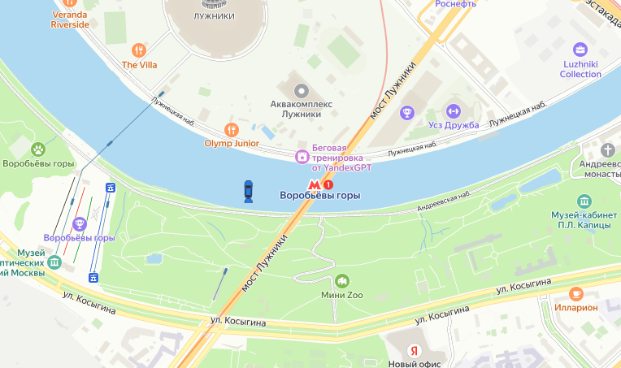

### BR-007 – Иконки машин на карте отображаются за пределами автодорог

🇷🇺 | **RU** 

**Предусловия:**
- Перейти на тестовый стенд.
- Ввести в поле «Откуда»: «Хамовнический вал, 18».
- Ввести в поле «Куда»: «Усачева, 34».
- Выбрать режим «Свой».
- Выбрать вид транспорта «Каршеринг».
- Нажать на кнопку «Забронировать».

**Шаги воспроизведения:**
1. В селекторе выбора тарифа выбрать тариф «Походный».
2. Проверить расположение иконок машин на карте.

**Ожидаемый результат:**  
Иконки машин отображаются на автодорогах и их направление соответствует логике дорожного движения.

**Фактический результат:**  
Часть иконок машин отображается вне автодорог, в том числе в водоёмах.

**Серьёзность:** Критический  
**Приоритет:** Высокий  
**Статус:** Открыт

**Окружение:**
- Операционная система: macOS Sonoma 15.2 (24C101)
- Браузер: Firefox 134.0
- Разрешение экрана: 1920×1080

**Вложения:**  
- Скриншот:

    

---

### BR-007 – Car icons on the map are displayed outside road boundaries

🇬🇧 | **EN** 

**Preconditions:**
- Open the test environment.
- Enter “Khamovnichesky Val, 18” into the “From” field.
- Enter “Usacheva, 34” into the “To” field.
- Select the “Custom” travel mode.
- Select “Car sharing” as the transportation method.
- Click the “Book” button.

**Steps to reproduce:**
1. In the tariff selector, choose the “Hiking” tariff.
2. Check the positioning of car icons on the map.

**Expected result:**  
Car icons are displayed on roads and follow the road layout.

**Actual result:**  
Some car icons are displayed outside roads, including on water areas.

**Severity:** Critical

**Priority:** High

**Status:** Open

**Environment:**
- Operating System: macOS Sonoma 15.2 (24C101)
- Browser: Firefox 134.0
- Screen resolution: 1920×1080

**Attachments:**  
- Screenshot:

    