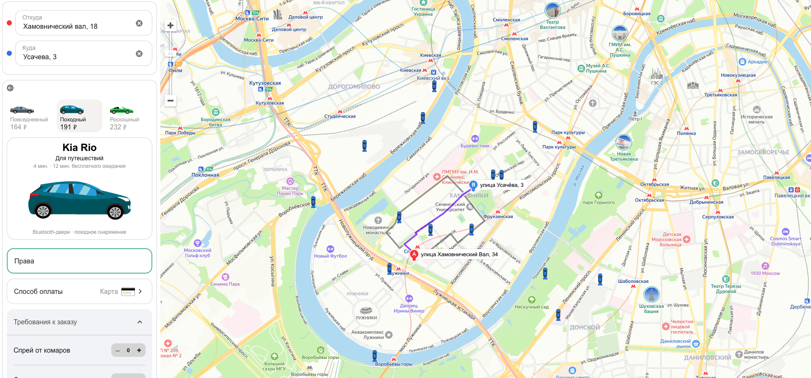

### BR-009 – Автоматически выбранная машина не выделяется на карте

🇷🇺 | **RU** 

**Предусловия:**
- Перейти на тестовый стенд.
- Ввести в поле «Откуда»: «Хамовнический вал, 18».
- Ввести в поле «Куда»: «Усачева, 34».
- Выбрать режим «Свой».
- Выбрать вид транспорта «Каршеринг».
- Нажать на кнопку «Забронировать».

**Шаги воспроизведения:**
1. В селекторе выбора тарифа выбрать тариф «Походный».
2. Проверить расположение иконок машин на карте.

**Ожидаемый результат:**  
Иконка автоматически выбранной машины визуально выделяется:

- иконка увеличивается на карте;
- над иконкой отображается чёрная плашка;
- на плашке отображается белая надпись с маркой автомобиля «Kia Rio».

**Фактический результат:**  
Иконка автоматически выбранной машины не увеличивается.
Чёрная плашка и надпись с маркой автомобиля не отображаются.

**Серьёзность:** Критический  
**Приоритет:** Высокий  
**Статус:** Открыт

**Окружение:**
- Операционная система: macOS Sonoma 15.2 (24C101)
- Браузер: Firefox 134.0
- Разрешение экрана: 1920×1080

**Вложения:**  
- Скриншот:

    

---

### BR-009 – The automatically selected car is not highlighted on the map

🇬🇧 | **EN** 

**Preconditions:**
- Open the test environment.
- Enter “Khamovnichesky Val, 18” into the “From” field.
- Enter “Usacheva, 34” into the “To” field.
- Select the “Custom” travel mode.
- Select “Car sharing” as the transportation method.
- Click the “Book” button.

**Steps to reproduce:**
1. In the tariff selector, choose the “Hiking” tariff.
2. Check the positioning of car icons on the map.

**Expected result:**  
The automatically selected car is visually highlighted:

- the car icon is enlarged on the map;
- a black label is displayed above the icon;
- the label contains the car brand name in white text: “Kia Rio”.

**Actual result:**  
The selected car icon is not enlarged.
No black label or car brand name is displayed.

**Severity:** Critical

**Priority:** High

**Status:** Open

**Environment:**
- Operating System: macOS Sonoma 15.2 (24C101)
- Browser: Firefox 134.0
- Screen resolution: 1920×1080

**Attachments:**  
- Screenshot:

    