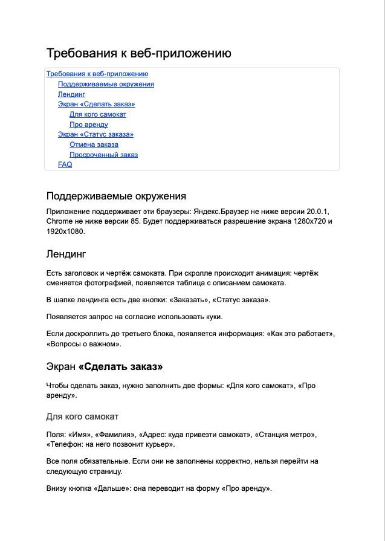
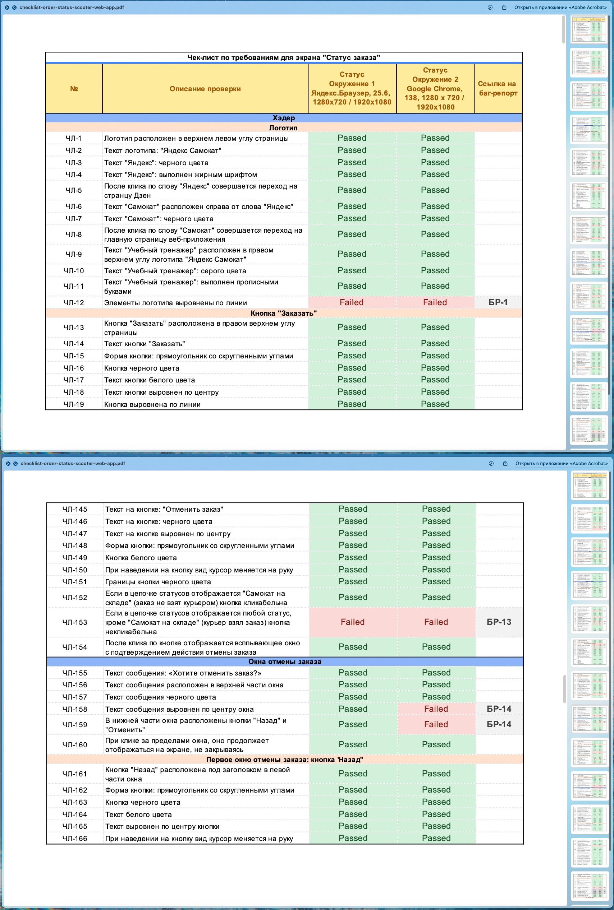
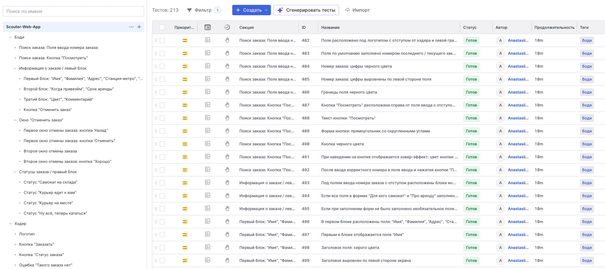
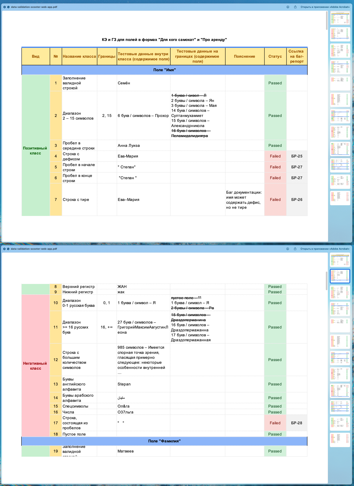
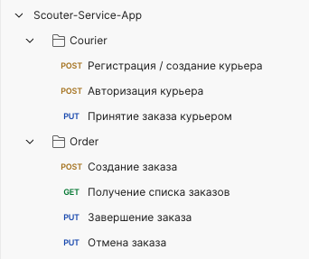
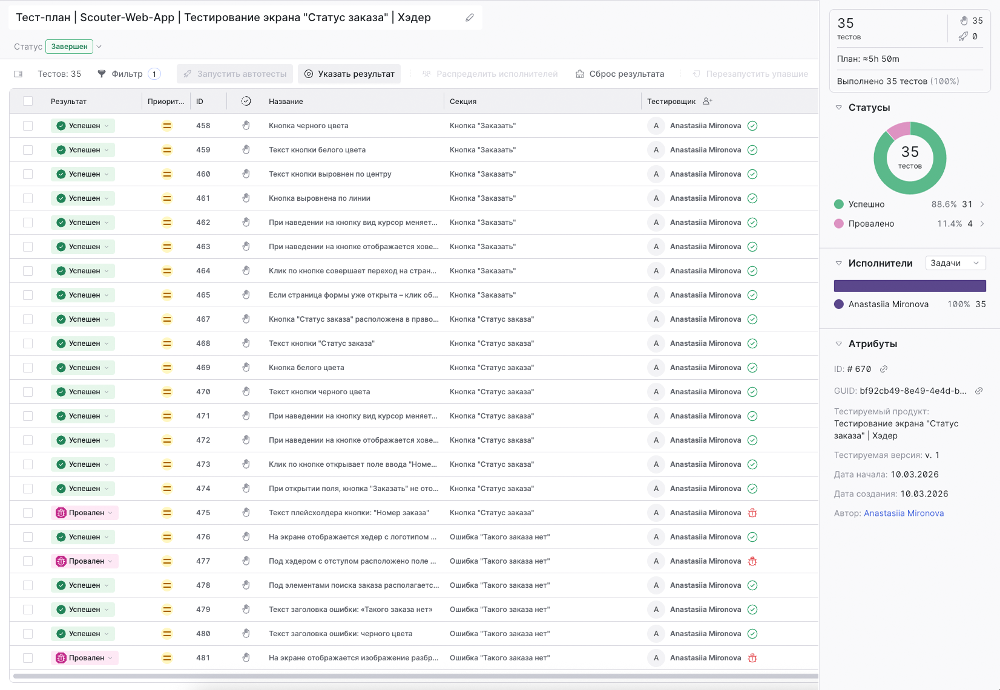
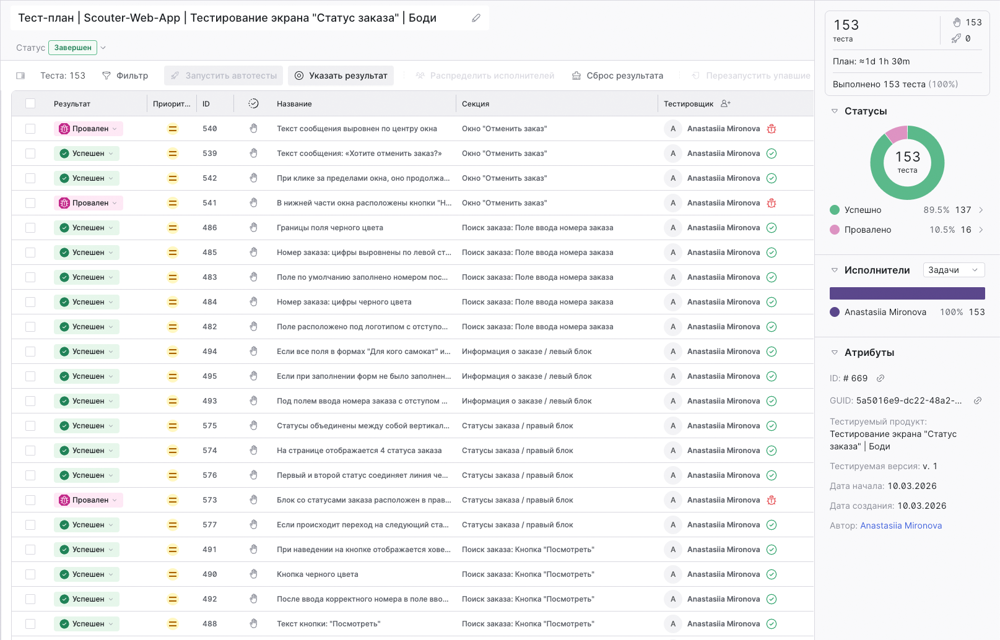
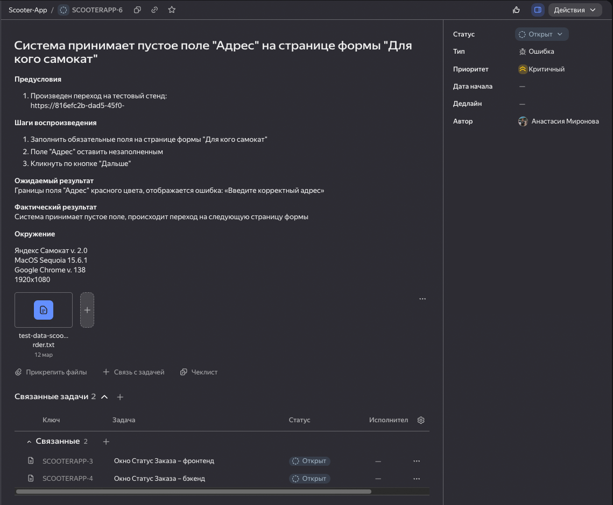
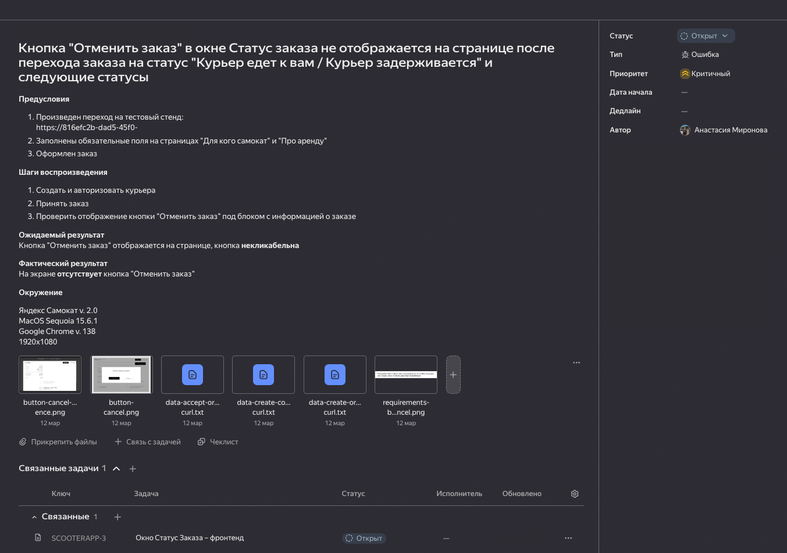

## Тестирование веб-приложения: приложение для аренды самоката

### Содержание

- [Описание проекта](#описание-проекта)
- [Связь с проектами в репозитории](#связь-с-проектами-в-репозитории)
- [Окружение](#окружение)
- [Чек-лист «Статус заказа»](#чек-лист-статус-заказа)
- [Проверка валидации окна «Сделать заказ»](#проверка-валидации-окна-сделать-заказ)
- [Создание тест-сценариев и выполнение тестирования](#создание-тест-сценариев-и-выполнение-тестирования)
- [Баг-репорты](#баг-репорты)
- [Выводы по результатам тестирования](#выводы-по-результатам-тестирования)

### Описание проекта

Проект посвящён ручному тестированию веб-приложения сервиса аренды самокатов.

Основной целью тестирования являлась проверка корректности работы ключевых пользовательских сценариев оформления и отслеживания заказа, а также проверка соответствия реализации требованиям и макетам интерфейса.

В рамках тестирования выполнялись следующие задачи:

1. Проверка функциональности экрана «Статус заказа» – разработка чек-листа на основе требований и проверка сценариев отображения статусов заказа (отмена заказа, просроченный заказ, изменение статусов).

2. Проверка формы «Сделать заказ» – проектирование тестовых данных для проверки валидации полей.

3. Функциональное тестирование на основе составленной тестовой документации.

4. Дополнительное тестирование интерфейса на соответствие дизайн-макетам (UI testing).

5. Кроссбраузерное тестирование веб-приложения.

[--> Наверх](#содержание)

### Связь с проектами в репозитории

Тестируемое веб-приложение является частью общей системы аренды самокатов, включающей несколько компонентов:

| Компонент                    | Назначение                                       | Ссылка                                                                                 |
| ---------------------------- | ------------------------------------------------ | -------------------------------------------------------------------------------------- |
| Веб-приложение               | Оформление заказа пользователем                  | Вы находитесь здесь                                                                            |
| Мобильное приложение курьера | Работа курьера с заказами                        | [Перейти](https://github.com/mrnvnst/GitHub-QA-portfolio/tree/main/Manual-Testing/Mobile-App/Scouter-Rental-Courier-App)                                                                            |

[--> Наверх](#содержание)

### Окружение

| **Параметр** | **Значение**  |
| --------------- | ------- |
| Браузеры             | Яндекс Браузер v. 25, Google Chrome v. 138 |
| Разрешения экрана             | 1280×720, 1920×1080 |

[--> Наверх](#содержание)

### Чек-лист «Статус заказа»

На основе требований к веб-приложению был разработан чек-лист для проверки функциональности экрана «Статус заказа».

Требования были предоставлены в текстовом формате.

Формат чек-листа не был строго регламентирован, поэтому тестовая документация была подготовлена в нескольких вариантах:

- таблица в Microsoft Excel / Google Sheets
- структурированный чек-лист в Test Management System — TestIT

Чек-лист в Microsoft Excel:

Чек-лист в TestIT:

Всего для проверки требований и макетов интерфейса было подготовлено 188 проверок.

После разработки чек-листа было проведено тестирование функциональности экрана. Результаты выполнения проверок представлены в следующем разделе.

[--> Наверх](#содержание)

### Проверка валидации окна «Сделать заказ»

Для проверки корректности обработки пользовательских данных была выполнена подготовка тестовых данных для формы оформления заказа.

При проектировании тестов применялись техники тест-дизайна:

- классы эквивалентности
- граничные значения

Использование данных техник позволило сформировать набор тестовых данных, обеспечивающий покрытие требований к следующим полям формы заказа:

**Форма «Для кого самокат»**

    - Имя;
    - Фамилия;
    - Адрес;
    - Станция метро;
    - Телефон.

**Форма «Про аренду»**

    - Когда привезти;
    - Срок аренды;
    - Цвет;
    - Комментарий.

Пример подготовленных тестовых данных:

Проверка валидации выполнялась двумя способами:

- через интерфейс веб-приложения (ручной ввод данных);
- через API-запросы с использованием Postman.

[--> Наверх](#содержание)

### Создание тест-сценариев и выполнение тестирования

После подготовки тестовой документации было выполнено тестирование функциональности приложения.

Ниже приведены примеры результатов прогона тестов в системе TestIT.

Проверки для элементов приложения в хэдере страниц:

Проверки для элементов, расположенных в основной части страниц:

В ходе тестирования был выявлен ряд дефектов различной степени критичности.

[--> Наверх](#содержание)

### Баг-репорты

Всего было выявлено **52 дефекта**.

Распределение по приоритетам:

|Приоритет|Количество|
|---|---|
|Блокирующий|3|
|Критический|9|
|Стандартный|27|
|Желательный|13|

Основные категории дефектов:

**UI-дефекты**

К данной категории относятся:

    - ошибки верстки
    - некорректные отступы
    - несоответствие элементов макетам
    - ошибки в текстах интерфейса

Пример:

    - элементы логотипа расположены на разных уровнях
    - элементы интерфейса имеют неправильные отступы
    - некорректные тексты плейсхолдеров

**Ошибки валидации данных**

Были обнаружены дефекты, связанные с некорректной обработкой пользовательского ввода:

    - система принимает пустые значения в обязательных полях
    - принимаются строки, состоящие только из пробелов
    - отсутствует ограничение на длину некоторых полей
    - принимаются невалидные телефонные номера

Например:

    - поле «Адрес» принимает пустое значение
    - поле «Фамилия» допускает ввод невалидного количества символов
    - поле «Комментарий» не имеет ограничения длины

**Ошибки бизнес-логики**

К наиболее серьёзным дефектам относятся нарушения бизнес-логики приложения:

    - неверное отображение выбранной станции метро на странице статуса заказа
    - отображение неправильной даты доставки
    - некорректная смена статусов заказа

Например, при завершении заказа статус «Курьер на месте» пропускается, и система сразу переходит к следующему статусу.

**Критические и блокирующие дефекты**

Были выявлены дефекты, напрямую влияющие на возможность использования системы:

    - невозможно подтвердить оформление заказа в Google Chrome
    - кнопка «Отменить заказ» отсутствует на странице статуса заказа
    - отменённый заказ продолжает отображаться при поиске по номеру и остаётся в базе данных.

Такие дефекты делают невозможным выполнение ключевых пользовательских сценариев.

**Примеры баг-репортов, оформленных в Яндекс Трекере:**

Система принимает пустое значение в поле «Адрес» формы заказа

Другой пример:

Кнопка «Отменить заказ» не отображается на странице статуса заказа

[--> Наверх](#содержание)

### Выводы по результатам тестирования

В ходе тестирования веб-приложения было выявлено значительное количество дефектов, включая ошибки интерфейса, проблемы валидации данных и нарушения бизнес-логики системы.

Особое внимание привлекают дефекты, влияющие на ключевые пользовательские сценарии:

- невозможность оформления заказа в браузере Google Chrome
- некорректная работа механизма отмены заказа
- ошибки в отображении и смене статусов заказа
 - отсутствие корректной валидации пользовательских данных

Наличие нескольких блокирующих дефектов указывает на то, что текущая версия приложения не готова к релизу без исправления критических ошибок.

Тестирование позволило:

- выявить дефекты в реализации требований
- обнаружить расхождения между макетами и интерфейсом
- определить проблемы в бизнес-логике системы
- сформировать рекомендации по улучшению качества продукта

Полученные результаты тестирования могут быть использованы командой разработки для приоритизации исправлений и подготовки приложения к последующим этапам тестирования и релиза.